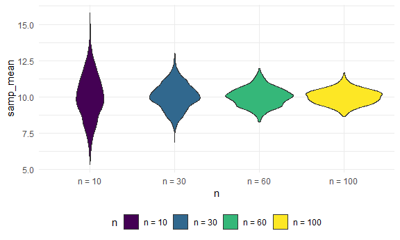
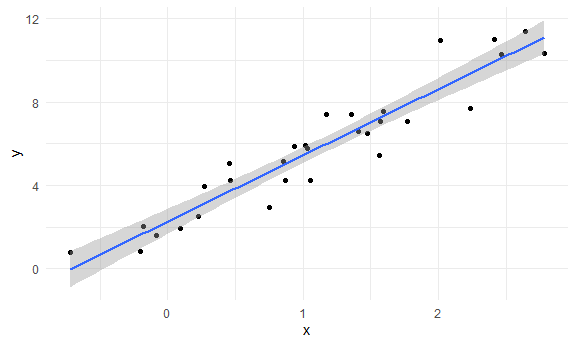
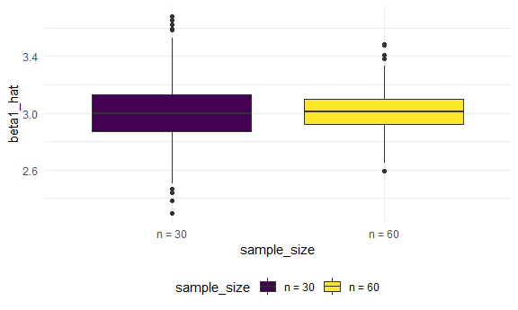
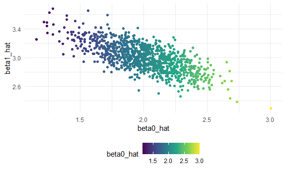
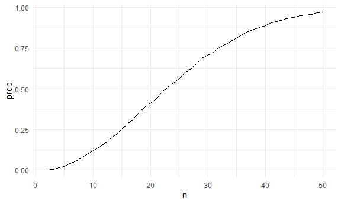

Simulation
================
Jinghan Zhao
2024-10-31

## Writing my first simulation

``` r
sim_mean_sd = function(samp_size, true_mean = 10, true_sd = 5) {
  
  sim_df = 
  tibble(
    x = rnorm(samp_size, true_mean, true_sd)
  )

  out_df = 
    sim_df %>% 
    summarize(
      samp_mean = mean(x),
      samp_sd = sd(x)
  )
  
  return(out_df)
  
}
```

Run this a lot of times …

``` r
sim_mean_sd(30)
```

    ## # A tibble: 1 × 2
    ##   samp_mean samp_sd
    ##       <dbl>   <dbl>
    ## 1      9.65    3.76

Run this using a for loop?

``` r
output = vector("list", 1000)

for (i in 1:1000) {
  
  output[[i]] = sim_mean_sd(30)
  
}

bind_rows(output) %>% 
  summarize(
    ave_samp_mean = mean(samp_mean),
    SE_samp_mean = sd(samp_mean))
```

    ## # A tibble: 1 × 2
    ##   ave_samp_mean SE_samp_mean
    ##           <dbl>        <dbl>
    ## 1          9.99        0.917

``` r
5 / sqrt(30)
```

    ## [1] 0.9128709

Can I use map instead?

``` r
sim_result = 
  tibble(iter = 1:1000) %>% 
  mutate(samp_result = map(iter, sim_mean_sd, samp_size = 30)) %>% 
  unnest(samp_result)
```

Could I try different sample sizes?

``` r
sim_result = 
  expand_grid(
    n = c(10, 30, 60, 100),
    iter = 1:1000
  ) %>% 
  mutate(sample_result = map(n, sim_mean_sd)) %>% 
  unnest(sample_result)
```

``` r
sim_result %>% 
  group_by(n) %>% 
  summarize(
    ave_samp_mean = mean(samp_mean),
    SE_samp_mean = sd(samp_mean)
  )
```

    ## # A tibble: 4 × 3
    ##       n ave_samp_mean SE_samp_mean
    ##   <dbl>         <dbl>        <dbl>
    ## 1    10          10.0        1.57 
    ## 2    30          10.0        0.890
    ## 3    60          10.0        0.635
    ## 4   100          10.0        0.510

``` r
sim_result %>% 
  mutate(
    n = str_c("n = ", n),
    n = fct_inorder(n)) %>% 
  ggplot(aes(x = n, y = samp_mean, fill = n)) +
  geom_violin()
```



## Simple linear regression

``` r
sim_data = 
  tibble(
    x = rnorm(30, mean = 1, sd = 1),
    y = 2 + 3 * x + rnorm(30, 0, 1)
  )

lm_fit = lm(y ~ x, data = sim_data)

sim_data %>% 
  ggplot(aes(x = x, y = y)) +
  geom_point() +
  stat_smooth(method = "lm")
```

    ## `geom_smooth()` using formula = 'y ~ x'



Turn this into a function.

``` r
sim_regression = function(n) {
  
  sim_data = 
    tibble(
      x = rnorm(n, mean = 1, sd = 1),
      y = 2 + 3 * x + rnorm(n, 0, 1)
    )

  lm_fit = lm(y ~ x, data = sim_data)
  
  out_df =
    tibble(
      beta0_hat = coef(lm_fit)[1],
      beta1_hat = coef(lm_fit)[2]
    )
  
  return(out_df)
  
}

sim_result = 
  expand_grid(
    sample_size = c(30, 60),
    iter = 1:1000
  ) %>% 
  mutate(lm_result = map(sample_size, sim_regression)) %>% 
  unnest(lm_result)

sim_result %>% 
  mutate(sample_size = str_c("n = ", sample_size)) %>% 
  ggplot(aes(x = sample_size, y = beta1_hat, fill = sample_size)) +
  geom_boxplot()
```



To see if beta0 and beta1 are correlated:

``` r
sim_result %>% 
  filter(sample_size == 30) %>% 
  ggplot(aes(x = beta0_hat, y = beta1_hat, color = beta0_hat)) +
  geom_point()
```



## Birthday problem!!

Let’s put people in a room.

``` r
bdays_sim = function(n){

  bdays = sample(1:365, size = n, replace = TRUE)
  
  duplicate = length(unique(bdays)) < n

  return(duplicate)
  
}

bdays_sim(10)
```

    ## [1] FALSE

Run this a lot!

``` r
sim_result = 
  expand_grid(
    n = 2:50,
    iter = 1:10000
  ) %>% 
  mutate(result = map_lgl(n, bdays_sim)) %>% 
  group_by(n) %>% 
  summarize(prob = mean(result))

sim_result %>% 
  ggplot(aes( x = n, y = prob)) +
  geom_line()
```


